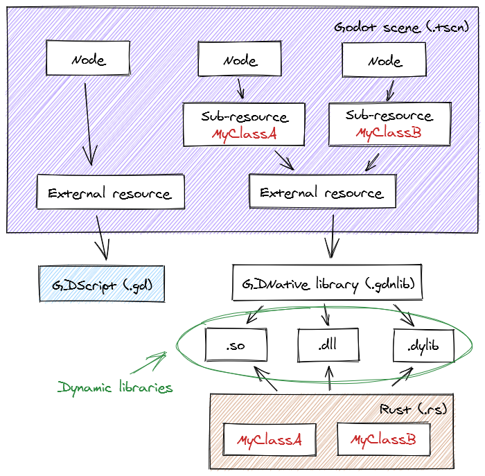

# Bind library with Godot

To bind the library to a Godot node, Godot Engine needs a GDNative library file (`*.gdnlib`) with the Rust/GDNative library paths. Create a new GDNative library file with the following minimal content :

```toml
[entry]

X11.64=""
OSX.64=""
Windows.64=""
Android.armeabi-v7a=""
Android.arm64-v8a=""
Android.x86=""
Android.x86_64=""
iOS.armv7=""
iOS.arm64=""

[dependencies]

X11.64=[  ]
OSX.64=[  ]
Android.armeabi-v7a=[  ]
Android.arm64-v8a=[  ]
Android.x86=[  ]
Android.x86_64=[  ]
iOS.armv7=[  ]
iOS.arm64=[  ]

[general]

singleton=false
load_once=true
symbol_prefix="godot_"
reloadable=true
```

Each entry in `[entry]` and `[dependencies]` is a different target.

| entry | OS | Architecture |
| ----------- | ---------- | ----------------------------------------- |
| `X11.64` | Linux | x86-64 (64-bit) |
| `OSX.64` | Mac | x86-64 (64-bit) |
| `Windows.64` | Windows | x86-64 (64-bit) |
| `Android.armeabi-v7a` | Android | ARMv7 (32-bit) |
| `Android.arm64-v8a` | Android | ARM64 (64-bit) |
| `Android.x86` | Android | x86 (32-bit) |
| `Android.x86_64` | Android | x86-64 (64-bit) |
| `iOS.armv7` | iOS | ARMv7 (32-bit) |
| `iOS.arm64` | iOS | ARM64 (64-bit) |

For example, assuming a 64-bit Windows-compatible Rust/GDNative library has been generated using `cargo build --release --target x86_64-pc-windows-msvc`, the 64-bit Windows-related entry can be changed into :

```diff
[entry]

X11.64=""
OSX.64=""
- Windows.64=""
+ Windows.64="res://target/x86_64-pc-windows-msvc/release/my_lib.dll"
```

Open and edit the Godot scene file (`*.tscn`) where the GDNative library will be used, load it as an external resource (`ext_resource`) with an unique identifier.

```toml
[ext_resource path="res://path/to/my_lib.gdnlib" type="GDNativeLibrary" id=1]
```

Then, create a _sub-resource_ with an unique identifier, link the newly created external resource with its `id` and pick a specific custom native class among the ones that were registered in the Rust/GDNative library, like `MyClassA` in the previous example.

```toml
[sub_resource type="NativeScript" id=1]
resource_name = "MyClassA"
class_name = "MyClassA"
library = ExtResource( 1 )
```

Finally, attach the _sub-resource_ to a specific existing node in the scene, using its `id` :

```toml
[node name="RootNode" type="Node"]
script = SubResource( 1 )
```

Once everything is binded, press <kbd>F5</kbd> on keyboard or  "_Play_" button at the top-right of Godot Engine UI to run the app preview.

Here is a summary, provided as a diagram.

